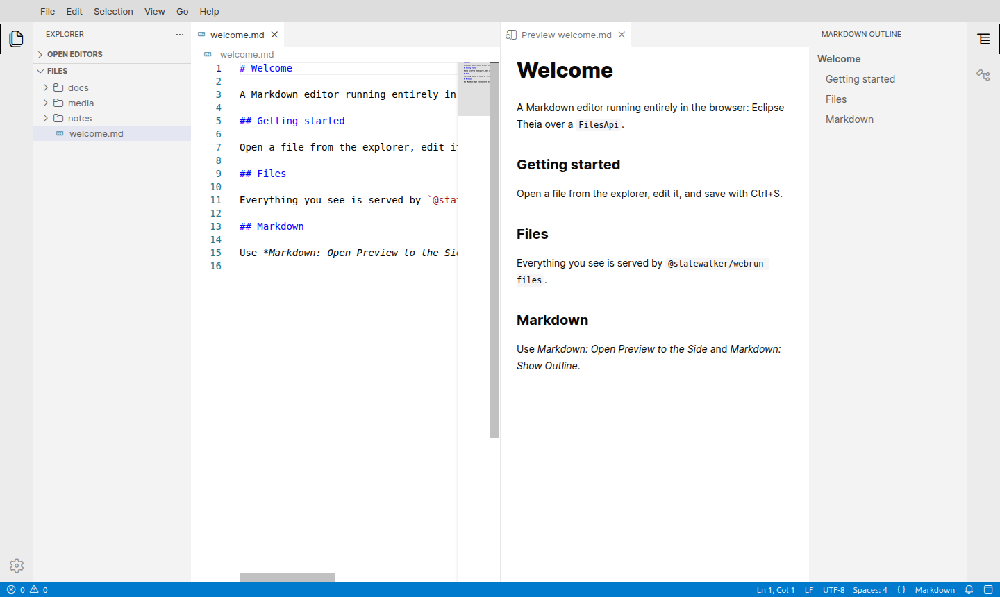
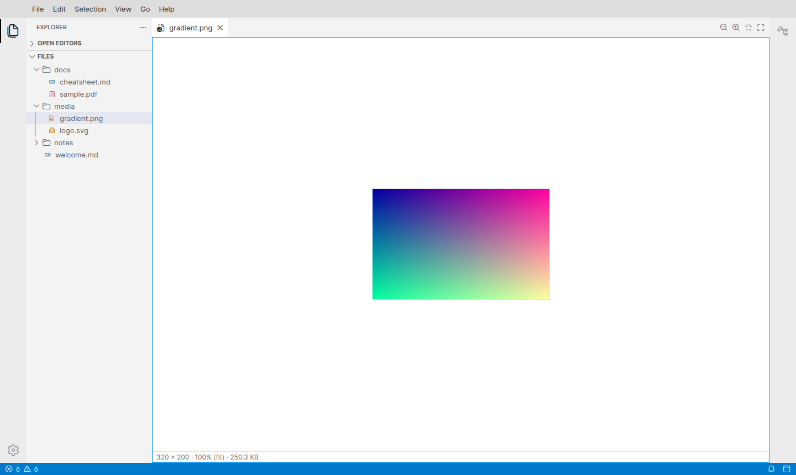
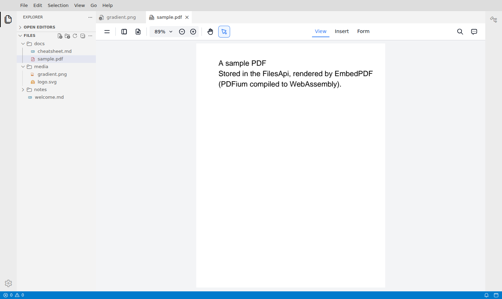
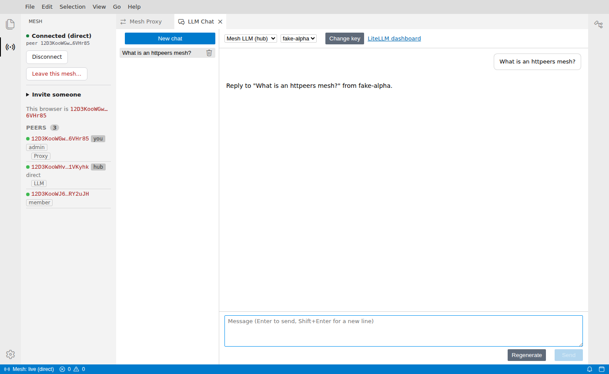
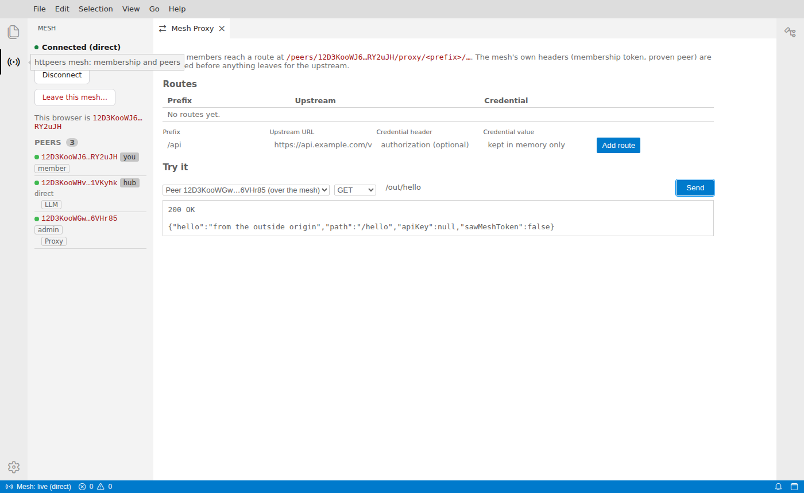

# @theia-shell/app

## What it is

A Markdown editor with image and PDF viewers, built on Eclipse Theia 1.76,
that runs entirely in the browser. It is also a member of an httpeers mesh.
There is no backend: the build output, `app/lib/frontend/`, is static files.
Files come from `@statewalker/webrun-files` `FilesApi` instances **mounted** as
the top-level folders of the explorer: browser storage, memory, folders on your
computer, S3 buckets. Secrets such as S3 keys live in a password-protected,
encrypted vault.

On the mesh, the app joins from an invitation, shows the peers and what they
serve, lets an admin invite others, chats with the mesh's LLM service (or any
OpenAI-compatible endpoint), and can expose outside HTTP origins to the other
members through a proxy.



The screenshots show the opt-in shadcn/ui style (*Appearance: Toggle shadcn/ui
Style*). The default is stock Theia.

| Image viewer | PDF viewer (EmbedPDF) |
|---|---|
|  |  |

| The Mesh view and the LLM chat, as an admin | A member calling the admin's proxy over the mesh |
|---|---|
|  |  |

## The app is a list of extensions

`app/package.json` has no code of its own. It declares
`"theia": { "target": "browser-only" }`, turns workspace trust off, and lists
the extensions:

| Package | Role |
|---|---|
| [`packages/theia-files-api`](../packages/theia-files-api) | **The file system.** `FilesApiFileSystemProvider` implements Theia's `FileSystemProvider` over a `FilesApi`. The frontend module rebinds `FileSystemProvider` (replacing browser-only OPFS) and `WorkspaceServer`, reveals the explorer, and names the root. |
| [`packages/theia-files-mounts`](../packages/theia-files-mounts) | **Mount points.** The main storage, the mount table (a `CompositeFilesApi`), filter layers, the `files.mounts` / `files.hidden` settings, the folder list and mount form, and Theia's settings under `shell-system:`. Memory, OPFS and local-folder types. |
| [`packages/theia-files-s3`](../packages/theia-files-s3) | **The S3 mount type.** A separate package because the AWS SDK is large. |
| [`packages/theia-secret-vault`](../packages/theia-secret-vault) | **Secrets.** A WebCrypto vault behind Theia's `KeyStoreService` / `CredentialsService`, its password dialog and commands. |
| [`packages/theia-file-panels`](../packages/theia-file-panels) | **File panels.** One-folder views in the main area, with a sibling-aware breadcrumb, sortable columns, and copy/move by drag and drop or menu. |
| [`packages/theia-markdown`](../packages/theia-markdown) | **Markdown.** Commands, menus, keybindings, the live preview and the outline view. |
| [`packages/theia-image-viewer`](../packages/theia-image-viewer) | **Images.** PNG, JPEG, GIF, WebP, AVIF, BMP, ICO and SVG in a zoomable view. |
| [`packages/theia-pdf-viewer`](../packages/theia-pdf-viewer) | **PDFs.** EmbedPDF (PDFium in WebAssembly), with no network access. |
| [`packages/theia-shadcn`](../packages/theia-shadcn) | **shadcn/ui.** The components, the tokens, and the opt-in *shadcn/ui style* (`appearance.style`) for Theia's menus, dialogs, buttons, inputs and toasts. |
| [`packages/theia-httpeers`](../packages/theia-httpeers) | **The mesh member.** `MeshService`, the **Mesh** view, the status-bar item, and `MeshContribution` for extensions that serve on the mesh. |
| [`packages/theia-httpeers-proxy`](../packages/theia-httpeers-proxy) | **The proxy.** Serves `/proxy` on the mesh from a route table; the **Mesh Proxy** view edits it and calls proxies. |
| [`packages/theia-llm-chat`](../packages/theia-llm-chat) | **The chat.** The **LLM Chat** view over the mesh hub's LLM service or an OpenAI-compatible endpoint. |
| [`app/files`](files) | **The app's defaults:** the Temporary mount, the hidden paths, the demo files, and where *New Markdown File* writes. |
| [`app/style`](style) | **The app's stylesheet:** Tailwind v4 without preflight over the extensions' sources, plus the shadcn theme. |

It also includes `@theia/search-in-workspace` (*Find in Files*,
`Ctrl+Shift+F`) and `@theia/file-search` (*Quick Open*, `Ctrl+P`). Both use
their browser-only modules, which walk the workspace through Theia's
`FileService`, and so through the `FilesApi`.

`app/esbuild.mjs` adjusts Theia's bundle: it copies the mesh ServiceWorker to
`lib/frontend/sw.js` and rewrites `import.meta.url` in
`@statewalker/webrun-http-browser` (see below).

## How to run it

From the repository root, on Node 24 with pnpm 10 (through corepack):

1. `pnpm install`
2. `pnpm --filter @theia-shell/app build`: builds the extensions (`tsc`, and
   Tailwind for `app/style`), then `theia build --mode development`.
   `build:prod` uses `--mode production`.
3. `pnpm --filter @theia-shell/app start`: serves `lib/frontend` on
   http://127.0.0.1:3000. Any static file server works.

Two storage modes:

- `http://127.0.0.1:3000/` keeps the **main storage** in the browser's Origin
  Private File System, so files and settings survive reloads. The first visit
  asks for a password for the secrets vault (*Skip* is allowed; tick
  *Remember on this device* to not be asked again).
- `http://127.0.0.1:3000/?storage=memory` keeps everything in memory, fresh on
  every load, with no password prompt.

An empty main storage ("Browser Storage") is seeded with `welcome.md`,
`notes/ideas.md`, `docs/cheatsheet.md`, `docs/sample.pdf`,
`media/gradient.png` and `media/logo.svg`.

### Joining a mesh

Open an invitation link whose page is this app
(`http://127.0.0.1:3000/?join=…`), or paste an invitation into the **Mesh**
view. For a whole mesh on this machine (a relay, the httpeers hub daemon with
its `llm` service over a fake LiteLLM, and an outside origin to proxy), run
from the repository root:

```bash
node tools/mesh-stack.mjs http://127.0.0.1:3000/   # prints admin and member invitations, and a URL minting more
```

It needs a built httpeers source tree at `$HTTPEERS_DIR` (default
`../httpeers` next to this repository). Each browser profile is one member:
open a member invitation in a second profile (or a private window) to see two
peers.

### Working with mounts, the main storage and secrets

The explorer's top-level folders are **mount points**, each one a workspace
folder. By default there are two: **Browser Storage** (the main storage, key
`browser`) and **Temporary** (in memory, key `temp`).

- **Add a folder**: *File → Mount File System…* or *Add Folder to Workspace…*
  opens the folder list: remembered folders, browser-storage folders not yet
  mounted, and *New Folder on this Computer…*, *New S3 Bucket…*, *New
  Browser-Storage Folder…*, *New In-Memory Folder…*.
  - *New Folder on this Computer…* opens the browser's folder picker first;
    the form then suggests the folder's name as the workspace folder's name.
  - *New S3 Bucket…* opens one form with the name, the mount path, and the
    endpoint, region, bucket, prefix and keys (the keys go to the vault).
- **Remove a folder**: *Remove Folder from Workspace* on its root. It is
  remembered and listed under *Add Folder to Workspace…*, where one click
  brings it back and the trash button forgets it. The main storage stays.
- **Edit Mount… / Reconnect**: on a mount's root in the explorer.
- **Settings**: mounts are the `files.mounts` setting, so they come back after
  a reload and can be edited in *Preferences: Open Settings (JSON)*. Secrets
  never appear there.
- **Hidden paths**: the `files.hidden` setting (globs; this app defaults to
  `**/.git`, `**/.git/**`, `**/.DS_Store`) hides paths from the explorer,
  editors and search, live.
- **Main storage**: *File → Choose Main Storage…* moves your settings and
  vault to a folder on your computer, or back to browser storage.
- **Secrets**: *Secrets: Unlock / Lock / Change Password / Forget Remembered
  Password / Reset Vault*. See
  [`theia-secret-vault`](../packages/theia-secret-vault) for the format and
  its limits.

## Why it is the way it is

### File content is data, never code

Files may come from other peers, so nothing in a file runs on the app's
origin. The Markdown preview runs markdown-it with `html: false` (raw HTML is
escaped, `javascript:` links are refused) and passes the result through
DOMPurify. SVG is shown through ``, so scripts inside it never run.

### Defaults live in extensions, not in the app's package.json

Theia ignores `theiaExtensions` in the application's own `package.json`. So
the app's bindings are in `app/files` and `app/style`, each a package with its
own `theiaExtensions` entry.

### A new kind of file system is one binding

Implement `MountType` from `@theia-shell/theia-files-mounts` (an id, a label,
the fields the form asks, and `create(mount, ctx)` returning any `FilesApi`)
in a frontend module of its own package, and `bind(MountType).to(…)`.
`theia-files-s3` is the example. Wrappers around the whole tree (filters,
guards, read-only) are `FilesApiLayer` bindings. List the package in the app's
dependencies. An app that wants one fixed `FilesApi` and no mounts can leave
out `theia-files-mounts` and bind `FilesApiSource` from `theia-files-api`
instead.

### The app compiles the extensions' Tailwind classes

`theia-markdown`, `theia-image-viewer` and `theia-pdf-viewer` are styled with
Tailwind utility classes and ship no CSS for them. Only the app knows which
extensions it includes, so `app/style` compiles those packages' sources (its
`@source` lines). An extension with Tailwind classes that is added to the app
must be added there too, or its classes have no CSS.

## What will surprise you

- **A mount that cannot be reached stays listed with its reason**:
  "Cloud (unavailable: …)", "Cloud (locked)" while the vault is locked,
  "Local Computer (click Reconnect)" when the browser needs a click to grant
  access again.
- **A local-folder main storage asks for one click after each reload.**
  Browsers require a user gesture to grant folder access again.
- **A reload right after adding a mount can lose it.** Theia fires the
  preference change before it writes `settings.json`.
- **Find in Files skips binary files.** It reads every file through the
  `FileService` and skips the ones it detects as binary, so a search for
  `IHDR` finds nothing although every PNG contains it. The check reads the
  start of the file, so a PDF that begins as plain ASCII, like the sample, is
  searched as text: its matches are raw PDF syntax, and opening one opens the
  PDF viewer. The text a PDF displays is not searched.
- **`search.exclude` would hide images and PDFs from Quick Open**, which
  applies it too. So binary types are not excluded there.
- **The mesh edge needs the origin root.** The ServiceWorker is served
  un-hashed at `/sw.js`. Serve the app from the origin root, over https or from
  localhost. Without the `import.meta.url` rewrite in `esbuild.mjs`, the edge
  throws `Invalid URL` and never starts.

## Reference

### Tests

Unit tests, per package:

```bash
pnpm --filter @theia-shell/theia-files-api test    # 23: the FileSystemProvider contract, external changes
pnpm --filter @theia-shell/theia-markdown test     # 15: outline, rendering, edits
pnpm --filter @theia-shell/theia-image-viewer test # 22: MIME types, fit, zoom steps, which changes reload
pnpm --filter @theia-shell/theia-pdf-viewer test   # 17: the generated PDF, which changes reload
pnpm --filter @theia-shell/theia-shadcn test       # 6: cn, the button variants, data-slots
pnpm --filter @theia-shell/theia-secret-vault test # 19: the vault, the KeyStoreService contract
pnpm --filter @theia-shell/theia-files-mounts test # 64: keys, configs, layers, mount table, workspace file, folder list, form, restore
pnpm --filter @theia-shell/theia-files-s3 test     # 4: client options, the RustFS fixture's CORS
pnpm --filter @theia-shell/theia-file-panels test  # 63: breadcrumb, sorting, formats, transfers, messages, file changes
pnpm --filter @theia-shell/theia-httpeers test     # 8: the peers list, status text, rules
pnpm --filter @theia-shell/theia-httpeers-proxy test # 15: routing, header hygiene, secrets
pnpm --filter @theia-shell/theia-llm-chat test     # 111: the chat core and the setup flow
pnpm --filter @theia-shell/app-files test          # 8: seeding, the PNG encoder
pnpm --filter @theia-shell/app-style test          # 6: the compiled CSS (build first)
```

End to end, against the static build (port 3100, or `E2E_PORT`):

```bash
pnpm --filter @theia-shell/app test:e2e
E2E_PORT=3110 pnpm --filter @theia-shell/app test:e2e
```

The specs in `app/tests` cover the explorer and saving, the Markdown
commands, preview and outline, the image and PDF viewers (a PDF renders with
no request to any other host), *Find in Files* and *Quick Open*, both styles,
mounts and the vault, S3 against RustFS (`s3.spec.ts`), restoring open files
after a reload (`restore.spec.ts`), the file panels (`file-panels.spec.ts`),
and the mesh: an admin and a member on a real mesh on loopback
(`mesh.spec.ts`), and the chat and proxy without one (`chat.spec.ts`). Every
test also asserts that the page raised no errors. The S3 and restore tests and
the panels' mount-recovery case need Docker (`tools/rustfs.mjs`) and are
skipped without it. `mesh.spec.ts` needs the built httpeers source tree.

### Markdown contributions

See [`packages/theia-markdown`](../packages/theia-markdown) for the commands,
menus, keybindings and views.
